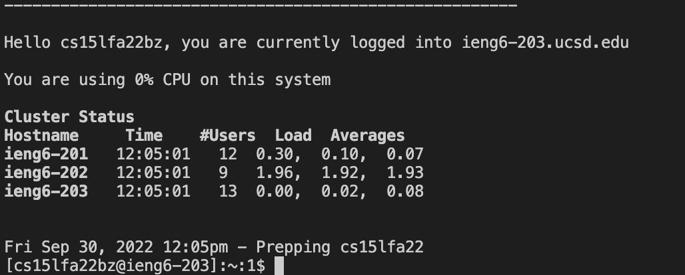

# Lab Report 1

## Installing VSCode

- I already had VSCode installed on my laptop from previous coding projects and classes so I did not have to install it when starting the lab

- However, if it is not already installed on your device, you can open the link [Install VSCode](https://code.visualstudio.com/download) and install it from there

- This is my VSCode application open

## Remotely Connecting

- This took a sec because I was having issues while logging in after changing my password for the cs15lfa22 account

- If you don't know what your specific course account is you can find it [here](https://sdacs.ucsd.edu/~icc/index.php)

- After I reset my password at a time outside of lab (when multiple people weren't trying to do it all at once) it worked!

- But it also changed my AD password... even though I'm 100% sure I unclicked the "change AD password" box

- This wasn't a big issue though, because after I got my cs15lfa22 account to work, I just changed my AD password again and then both accounts worked fine

- I was then able to run the command `ssh cs15lfa22zz@ieng6.ucsd.edu` (replacing the zz with the characters specific to my account) which then logged me in!

- The output after logging in should look a little like this:

 
## Trying some Commands

- I then tried running some commands on the remote client

- some examples that I tried were `cd`. `ls`, `cd ..`, `ls -a`, etc
## Moving Files with scp

- scp is used to move files from the remote and local client (e.g. your computer and the CSE Building computer)

- Following the tutorial, I created a file called `WhatAmI.java` which had the contents

- I was able to do this by typing in `touch WhereAmI.java` in the command line which then created the file as you can see after I run the `ls` command
- To edit the contents of the file I ran `open WhereAmI.java` which opened the file on VSCode and I was able to copy and paste the code given to me in the tutorial
- I then compiled and ran the code on my laptop using `javac`(compiling) and `java`

- The second half of the screenshot is where I then ran the `scp` command to copy it to my account folder on the remote client (CSE Basement Computer)

- After running those commands, I log back into the remote server and run `ls` which now shows that `WhereAmI.java` now exists in my user folder

## Setting an SSH key
- An ssh key can help you switch between your local and remote server faster compared to having to enter and re-enter your password over and over again which is quite a hassle

- To create one, I first ran `ssh-keygen` on my laptop and then just pressed enter when prompted for the file to save the key in (I first made the mistake of copying the path printed by the terminal which did not work)

- Then I'm prompted for a passphrase which can be anything you like! If you don't want any passphrase you can simply press enter

- Then you need to create a .ssh file on the remote client

- I first create a .ssh directory after logging into the remote server

- Then from my laptop, I run the `scp` command to copy the public key to the .ssh folder I create in my account on the remote server

- After entering the passphrase I created earlier, it instantly logs me in to the remote server --> much faster than earlier!

