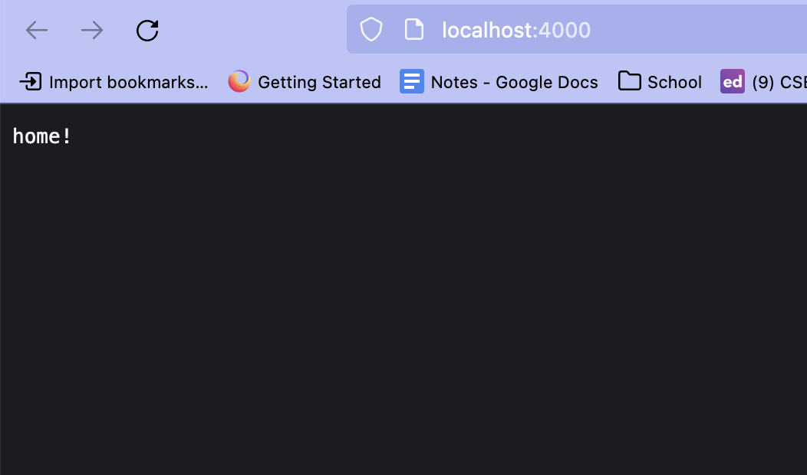
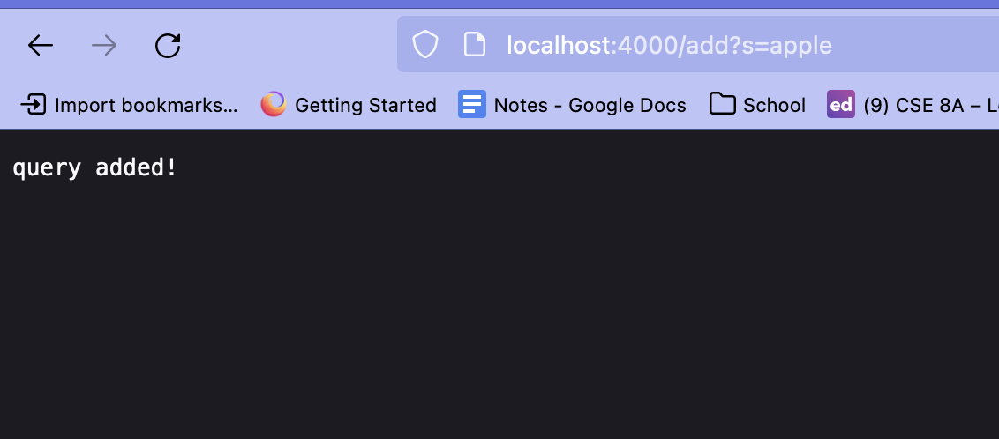
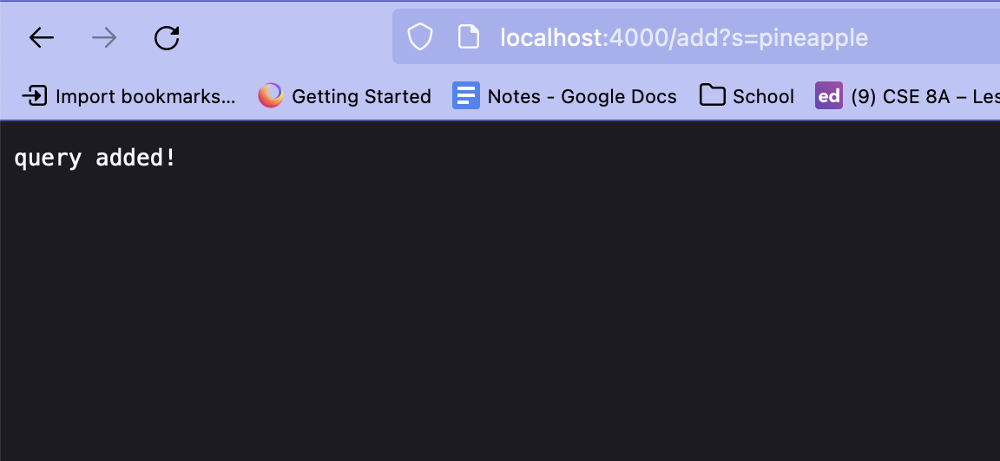
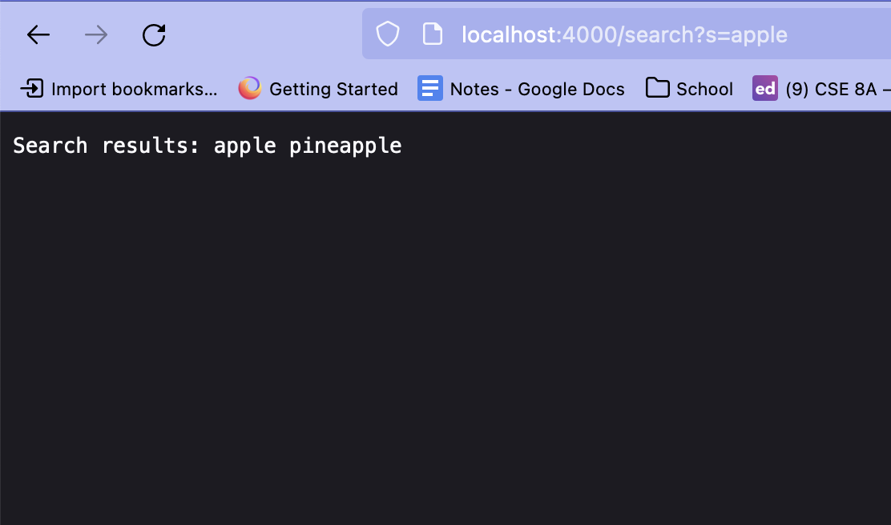

# Lab Report 2

## Part 1
During lab last week, I completed the Simplest Search Engine task that we were assigned in lab. This was my code for the Engine:

```
class Handler implements URLHandler {
   // The one bit of state on the server: a number that will be manipulated by
   // various requests.
   int num = 0;
   ArrayList<String> list = new ArrayList<String>();
   public String handleRequest(URI url) {
       if(url.getPath().equals(“/")){
           return String.format("home!");
       }
       if(url.getPath().contains("/add")){
           String[] parameters = url.getQuery().split("=");
           if(parameters[0].equals("s")){
               list.add(parameters[1]);
               return String.format("query added!");
           }
       }
       else if(url.getPath().contains("/search")){
           String[] parameters = url.getQuery().split("=");
           String ret = "";
           if(parameters[0].equals("s")){
               String sub = parameters[1];
               for(int i = 0; i< list.size(); i++){
                   if(list.get(i).contains(sub)){
                       ret = ret + list.get(i) + " ";
                   }
               }
               return String.format("Search results: %s", ret);
           }
       }
       return "404 Not Found!";
   }
}

```

This was the search engine after opening the local host url:



I then proceeded to add two different words (apple & pineapple) to the program that could later be queried:




For these, my code first checked if the url had the string "add" in the path. If it did, it entered the if-statement block and proceeded to get the parameters and split them into an array. When the user tries to add a word to the list, the word is 'stored' as the variable s in the string, so after checking the array that splits them up, we are able to see whether the first element of the array is s. This means that the next element in the array is the word we need to add, and thus after checking that, we add it to the list.

Finally, I tried searching for the substring "apple" which then returned both the words we added earlier since they contain the substring we searched for.



For search, it was a a similar process where we checked if search existed in the path and then checked the parameters but this time instead of adding the word the user inputted to the list, we use it to search through our list using a loop and return all the words that contain the string the user chose.

## Part 2