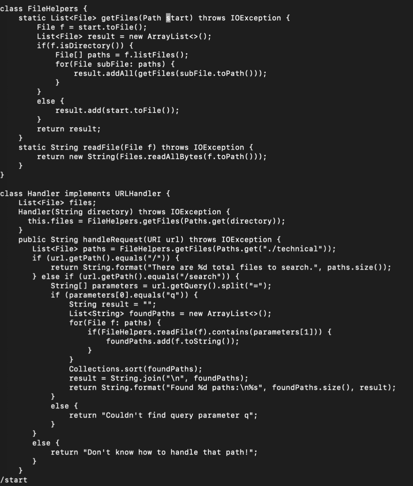
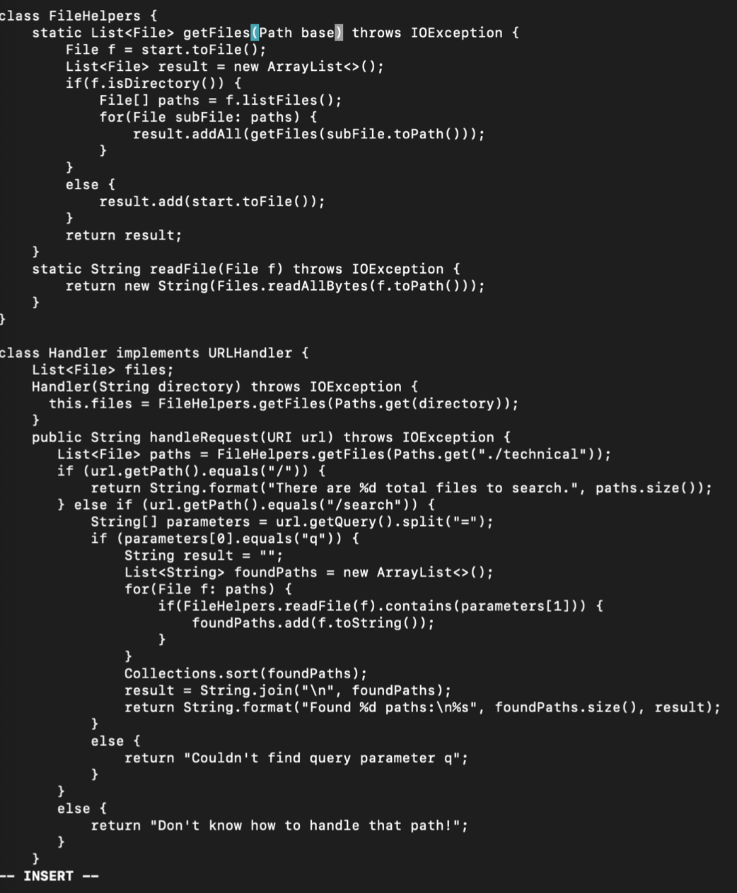
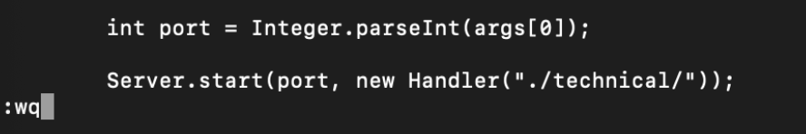

# Lab Report 4

## Part 1

For this part, we are going to be changing the name of the start parameter and its uses to base in getFiles()

### Look up the term

Here, we begin by looking for the term that we want to overwrite. In order to do this, we can type "/[term]" as a command to get the term. After we type the command, the program highlights the term and its first letter.

### Replace it

Now that we have found the term, we can replace it with the following command: "c+e". This command highlights the term we previously looked up and deletes it. Additionally, this also switches us into insert mode so that we can insert the word that we want to replace it with. We can then type in "base". Also, for consistency, we have to replace all instances of the word "start" with the word "base". To do this we can use the keystroke "n" to find all the remaining instances and then use the keystroke "." which runs the "c+e" command again to replace this next term. We do this continuously until all instances have been completed.

### Saving it

After we have finished with our changes to the file, we can now save it. In order to do this, we can use the command ":wq" that saves the file and exits.

### Finishing Up

The limit for the total number of keystrokes for this was 30 keystrokes maximum.

The total sequence of our keystrokes was:

`/+s+t+a+r+t+<Enter>+c+e+b+a+s+e+<Escape>+n+.+n+.+<Shift>+:+w+q+<Enter>`

If we add all of this together, we get 23 keystrokes—success!

## Part 2: Remote Work

### Comparing VSCode and VIM

VSCode - 1:02 minutes

This took a while because there were just a lot of minor steps that would trip me up and I would forget about. For example, moving my mouse to the wrong places, saving the files, mouse clicks, etc.

Vim - 43 seconds

This was a lot faster because it cut down on a lot of unnecessary movement and made me more efficient. However, I do like the process of moving my mouse around because I feel like I'm more in control and am more of a visual person.

However, it is efficient when trying to edit a file remotely which is where I think I would use Vim. Also the size of the file/project I'm working on will also affect what I choose to use. I'd rather use VSCode for larger projects because it is more intuitive for me and then use Vim for smaller projects.
